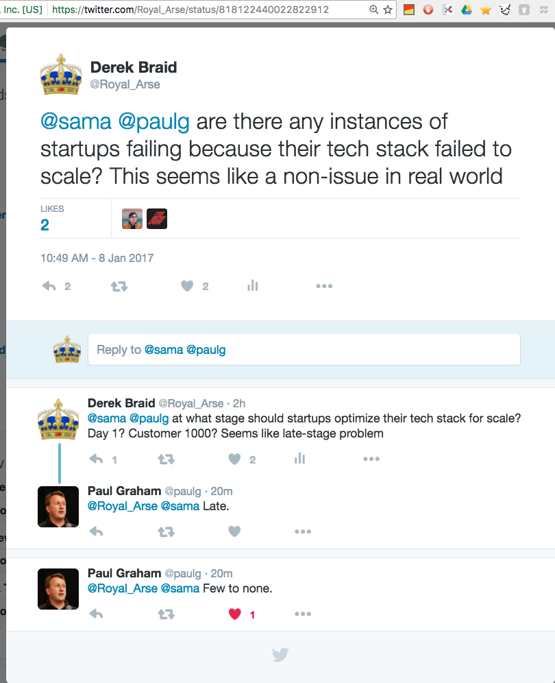

# Premature Optimization 

Unix world offers the philosphy “Premature optimization is the root of all evil”. 

Does this apply to modern startups?  My hunch is YES! 

This post was inspired by a YouTube commenter (frustrated with Meteor scaling issues).  Youtube comment is [here][2].

Back to Unix
> "Get it working before you optimize it." 

The most basic argument for prototyping first is Kernighan & Plauger's quote: 
> “90% of the functionality delivered now is better than 100% of it delivered never”. 

"Prototyping first may help keep you from investing far too much time for marginal gains. For slightly different reasons, Donald Knuth (author of The Art Of Computer Programming, one of the field's few true classics) popularized the observation that “Premature optimization is the root of all evil”.[11] And he was right." [Source: Basics of Unix Philosophy][1].

> Rule of Optimization: Prototype before polishing. 

Unix community is unambigous about their goals to prototype, then scale.  More from [Basics of Unix][1]: 

> In the Unix world there is a long-established and very explicit tradition that says: Prototype, then polish. Get it working before you optimize it. 

Stated otherwise; *Make it work first, then make it work fast.* 

‘Extreme programming' guru Kent Beck, operating in a different culture, has usefully amplified this to: 

> “Make it run, then make it right, then make it fast”.  

## Application for Modern Startups

Why is this?  Lets focus on two (of many) possible reasons startups die: 

A.  no traction 
B.  tech stack impedes scaling 

It is far more common to die from A than B.  A means the product is broken, and your tech stack should optimize for building & refining features users will love, not prematurely optimizing for scale.

> Your startup might die if the tech stack you use can't scale up.

Can you show some examples of this? Are there any instances of startups dying because their tech stack prohibited scaling?

It's not clear there is any data here.  Some have speculated that MySpace was killed because it couldn't scale.  The overall tone [here][MySpaceLink] suggests: 

> MySpace's problems are much less about the technology platform choices they have made (Microsoft vs. anything else) and more about engineering leadership, market positioning and time to react, etc.

[SVSG][SVSG], Silicon Valley Software Group (international group of CTOs who provide technology leadership and distributed engineering to companies of all sizes) asks:

Will my tech stack scale? 

> Choosing a tech stack is a commitment that’s not easily reversed, so concerns related to future circumstances like scalability and performance are common. However, trying to address these concerns at the MVP stage *would be premature*.

They say at the MVP stage, because being nimble and creating features is key.  They clarify: 

> Many performance issues are a product of application design, not technology choice. They can be resolved through tuning and optimization, and you’ll have a bigger budget to deal with them as you grow.

Once you have traction, you can raise money to address scaling issues.  This is a hard problem, but a necessary one.  If you don't have the right features, you will never encounter this problem, so get the MVP right, and make something people love. 

Paul Graham in his "beating the averages" essay: 

> This is not just a theoretical question. Software is a very competitive business, prone to natural monopolies. A company that gets software written faster and better will, all other things being equal, put its competitors out of business. 

I put the question to PG on [twitter][PG], his response: 

Agility over optimizing for scale.  He continues: 

> And when you're starting a startup, you feel this very keenly. Startups tend to be an all or nothing proposition. You either get rich, or you get nothing. In a startup, if you bet on the wrong technology, your competitors will crush you.

Emphasis on moving quickly, not scaling.

[1]:homepage.cs.uri.edu/~thenry/resources/unix_art/ch01s06.html
[2]:https://www.youtube.com/watch?v=668vPl7q3xg&lc=z12zzv2pjsvjw5yaj04ccb5bozjxefuqkj4.1483890770309382
[MySpaceLink]:highscalability.com/blog/2011/3/25/did-the-microsoft-stack-kill-myspace.html
[SVSG]:svsg.co/how-to-choose-your-tech-stack/
[PG]:https://twitter.com/Royal_Arse/status/818122440022822912