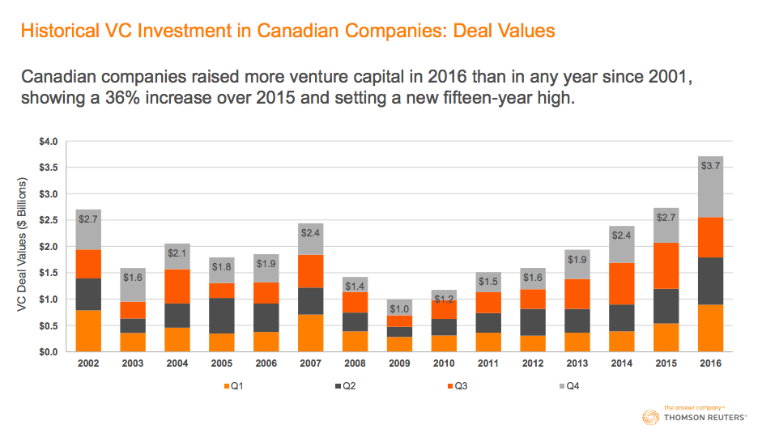
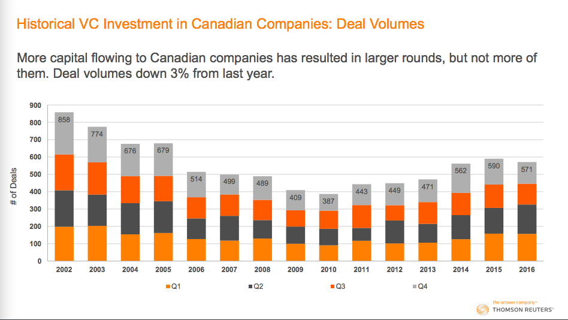
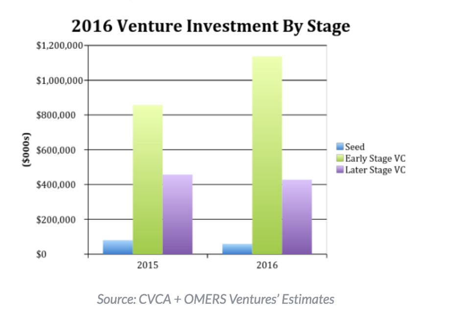
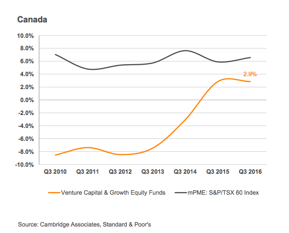
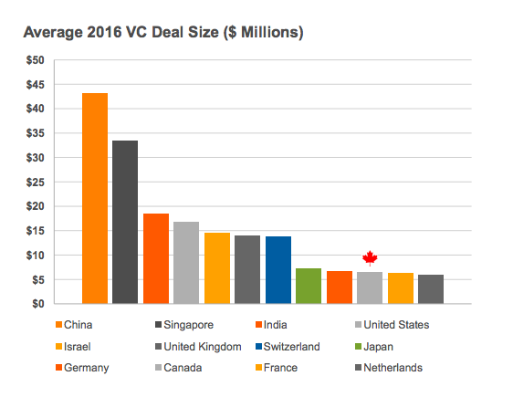

# Role Of Seed Capital in Economic Development

An essay on transformation impact of seed capital for entrepreneurs and it's cascading effect on regional economic development.  Focusing on Canada, I'll show that VCs are flush with cash but do not allocate enough to seed and pre-seed ventures, and consequently fail to generate comparable returns to US VCs, or stock indices. 

Allocating more VC to seed stage companies gives founders a risk-taking runway and encourages talented people to take necessary risks to start a company.

By *Derek Braid*, aka [@Royal_Arse](https://twitter.com/Royal_Arse/status/818476729022955520).

## Runway: Put Founders First

Put yourself in the shoes of a talented, ambitious person, lets call her Linda.

Linda is an educated mother of 2.  She has a background in a STEM field, and has domain expertise in finance.  She is gainfully employed at a large bank, but sees inefficiency that software could eliminate.  

Linda has two colleagues, one a former university roommate, another current coworker, with an itch to start a startup and would make great co-founders. 

### How to Start a Startup?

What steps should they take to break off and start their own business?  They should quit their job to give 100% focus on building their new business.  Committing full-time and attention to the new task must be all encompassing in order to succeed!  Therefore they must give up their income and sacrifice for their passion.

There's a problem: they have `good jobs`, and families, and mortgages, etc.  Like most people under 50, they have limited savings.  They need a runway.

Without a runway, founders are essentially risking their financial livelihoods to start a business.  This seems perverse in a culture that desires more small businesses. 

These founders might have to move back in with their parents!  That happened to @alec_levin and his girlfriend who resorted to moving back home with their parents while trying to start a startup.  [Alec says](https://medium.com/@alec_levin/losing-a-home-and-the-value-of-a-dollar-661bb0b1164a#.xkbbjzyux): 

> Going back to my parents’ home was one of the hardest things I’ve done. 

He continues to describe the great sacrifices required to start a company, and get some cash flow: 

> At one point I started delivering food for Hurrier on my bike... I froze my ass off for a few months delivering food downtown for about $14 an hour.

What if a small seed round enabled founders like Alec to focus more on their startup and less on immediate cash flow?

Clearly the founders would benefit, and so would the economy.

## Seed is the Runway

Seed capital is the runway that lubricates capitalism.  

It is the *minimum basic income* to allow founders to eat and sleep in their home without moving back in with their parents, or squatting with 5+ roommates in a small house. 

Seed capital reduces the financial risks for startup founders.  $100k divided by 3 founders, means they can dedicate 1 year of their lives to nothing but building a new company and be paid just below median income (in Canada).

This is the minimum basic income that someone earning 6-figures will accept to leave their job, take the personal and professional risks required to start a startup. 

And that is just to start!  The risks are much greater and varied, but the most obvious impediment is that founders are scared of having $0 income.  Eliminate this issue by allocating many small seed investments ($100k in exchange for 5-10% equity).

### VC in Canada 2016

Some different numbers out there based on source.  Bottom line: 2016 was an unremarkable year for founders (flat-ish growth), but a boom for VCs (record capital raised).  

[PWC][PWC] reports total VC deals up to 266, from 246 the year before. Total investment of $2.2 billion ($1.7 billion USD) was flat year-over-year.  By contrast, US VC deals and dollars dropped 16% and 20%, respectively.

OMERS Ventures estimates that total VC invested into Canadian startups increased 15% year-over-year in 2016.  Early-stage startups received most of that increase, while investment in late-stage companies contracted.  Other data from [Thompson Reuters][TR], suggest:

> 459 Canadian companies closed 571 rounds of financing totaling $3.7 billion. 

Methodology differences likely account for the contrasting figures, as TR includes "Investment by Canadian funds in non-Canadian companies" ($680 million, 92 deals), which (it appears) @OMERSVentures omits.

## Charts

### Total Dollars Up

### Total Deals Down

It is encouraging to see early-stage companies getting more funding year-over-year.  Growth was driven by large cap VC deals, with 14 companies raising rounds $50 million or greater in 2016, boosting the average VC deal size to $6.5 million (encouraging but still well behind USA ($16.7 million), UK ($13.9 million), and Israel ($14.4 million)).

Despite some gains in total dollars, Canada has long way to go, especially in terms of seed funding (down YoY).  More seed funding is essential to foster innovation and breed successful startups, the lack of seed capital in Canada is alarming, and needs to be corrected.

Clearly seed stage is lacking in Canada, this article aims to explore why pre-seed financing is so important for economic growth.

### VC Funds are Flush with Cash 

Canadian venture capital fundraising up 81% YoY, with 26 funds raising $2.2 billion in 2016 (a 13-year high, via [PEHub][PEHub]).

Despite this, according to [Thompson Reuters][TR] the number of VC rounds was down 3% YoY, and the number of companies financed fell by 7%.

## Canadian Fund Performance: WOMP WOMP

Current approach to VC in Canada is not working.  The performance of Canadian VC has been awful, returning only 2.9% (for funds started 2000 or later, VC & growth equity funds data from Cambridge Associates, via [TR][TR]).

Returns lag far behind US counterparts, public market equivalents, and only recently returning to positive territory.  Results-oriented culture might force the VCs to try another strategy, such as many more, smaller deals (spray and pray) vs. current post-Series A rounds (smartest person in the room).

<!-- clipped notes on Seed as Runway -->

This is close to YCombinator, Tech Stars, 500 Startups.  This model has proven widely successful, and I'll argue is the most effective approach to VC.  Bottom-up (founder-led) results will exceed top-down (VC-led) results.   
The most successful startup incubators in the world operate on this premise, Canadian VCs should take note.

## Passive VC: thing or not a thing?

Passive VC, in my terms, is something like what YCombinator (YC) and other incubators do.  Incubators shares the following characteristics: 

* cluster a cohort of seed-stage startups 
* each startup gets an office for 3-6 months, and enough money get their MVP polished and shipped
* the terms and process are simple and transparent: $100k, 7.5% equity, 13 weeks

The rest will take care of itself (it's not easy, but it can be simple).

Because equity is involved the incentives of founders and investors are aligned (unlike many popular Toronto-based incubators).  Incubators should not behave like charities but capitalist-based businesses.  Take equity, be a partner with some skin in the game. 

## Ego, Performance, Culture

Lets talk about the poisonous impact of ego in investing.  Active investors play the losers game despite the data showing how fleeting the returns are for active traders.  They want to be the smartest person in the room, or on Earth.

Seed stage investors call themselves 'angels' FFS...

VCs hold onto the cash because it gives them power.  Once they invest, the power shift to the entrepreneur.  Seed capital empowers entrepreneurs to take necessary risks.  

In finance there are institutional reasons that encourage bad behaviour.  In VC, growth is over-valued while longevity/durability is under-valued (source: [Peter Thiel][PT]).  

### Why is growth valued over durability?

> most of the value of startups exists *far in the future*. 

If you run a sophisticated financial model like DCF (discounted cash flow), or do the math on profit streams, there are two components. 

A) growth rate 
B) discount rate 

Using PayPal as a case study, (in March of 2001), growth rate was 100% a year, discounting future cash flows by 30%, means roughly 75% of the value of the business came from cash flows 10 years in the future and beyond!

Generally, you can apply this across most high-growth startups. 

> 75-85% of company value is realized 10 years from now... 

Because it's so far in the future, everyone wants more growth to realize value sooner.  Thiel emphasizes that in Silicon Valley, "we always over-value growth rates and we undervalue durability".

This also solves another pesky issue for VCs: *performance bonuses*.  The culture of banking and finance is that quarterly and annual reports are required to asset performance.  3 years is a lifetime in banking, and 5-10 years is a career.  Most people are looking for their next job by then, and want to have received several annual bonuses.  This is why equity is so vital to successful incubators. 

### Importance of Equity 

Equity ensures the investors are committed to long term outcomes.  Ownership is vitally important to align incentives.  Skin in the game matters, as Michael [Dearing][Dearing] likes to point out: 

> "... treat yourself to good equity partners." 

In Toronto, many of the incubators act like charities.  They provide a roof, and guidance, but little money and don't take ownership.  Investors, mentors, etc, should take equity!  Get some skin in the game.  Founders should treat themselves to business partners who are tangibly invested in your success, it will likely work out better for all parties.  

## OMERS

OMERS Ventures made 4 investments in 2015.  THIS IS INSANE.  They raised $260 Million dollars in 2015.  Total funding $470 million, they self-proclaim "...our two funds together represent one of the largest long-term private capital pools active in Canada’s venture sector"

From 2011-2015 OMERS Ventures invested in 23 startups, "doubling venture capital spending", via [Financial Post][FP].

### OMERS vs Canadian VC 

OMERS is not the only party to blame for the sorry state of Canadian seed funding!  Every single VC in Canada should give their head a shake and stop pretending they can pick winners (or produce the data to prove they can!). 

The numbers are striking: US investors provided more than HALF all venture capital in Canada.  They will skew towards growth rounds because established companies are less likely to die than pre-revenue startups.

Back to the figures.  Estimates from OMERS suggest *American investors provided ~52% of all venture capital invested in Canadian startups in 2016* ($559 million CAD).  Fifty cents on the dollar comes from the US?! Surely this is anomalous?  Nope.  Last year (2015), US investors contributed ~ half of all VC, a total of $482 million into Canadian market (48% of total).

## Demand for Quality Incubators

Ryerson DMZ is so successful it is busy to the point of being crowded, via [Ottawa Business Journal][OBJ]: 

> The competition for space in the DMZ is high, and some of the startups talked about “squatting” in a facility that is packed to the rafters. Others noted the huge number of companies in the DMZ makes it very difficult to find experienced mentors and sources of funding 

List of Incubators in Canada (from 2014, via Mars): https://www.marsdd.com/mars-library/accelerators-incubators/

##  YC Clones?

One of the key benefits to YC is standardized term sheets and simple process.  There is a Montreal-based firm attempting to bring some of the YC magic to Canada.

### FounderFuel

FounderFuel describes itself as "3 distinct projects, loosely coupled but complementary: a seed fund (Real Ventures), an accelerator (FounderFuel), a community hub (notman.org)".  

Results over 5 years, 9 cohorts and 73 startups, [source][AboutFF] and [here][FF2016Review]: 

* 13 week program based in Montreal
* focused on the pre-seed to seed stage
* 67 companies since 2011 
* $6 million in funding from Real Ventures in 2012
* 14 acquisitions, 13 shutdowns, remaining in operation 
* investment of ~$100K for ~5% in equity. 

### The FounderFuel Way 

Screening startups, FounderFuel will ask founders as 3 Questions: 

1.  Why should people care? 
2.  Why should people believe? 
3.  Why should people join? 

### Lessons

* time is of the essence. The deadline is a catalyst. “What is your ambitious goal for the next 3 months?"
* founders and teams matter the most. Resilience, curiosity, humility and persistence. 

Conversely, building a startup ecosystem from scratch is a 20-year investment, via [Brad Feld](http://knowledge.wharton.upenn.edu/article/techstars-brad-feld-a-startup-community-needs-a-20-year-time-horizon/).  So be in it for the long haul.

## Mid market VC is a trap! 

Peter Thiel in his lecture to Stanford student provides this inThere are businesses that are perfectly competitive and there are businesses that are monopolies. There is shockingly little that is in between. startupclass.samaltman.com/courses/lec05/

Over a year since @marcusdaniels wrote: Canada needs more pre-seed & seed in VC. http://www.huffingtonpost.ca/marcus-daniels/pre-seed-funding-venture-capital_b_8451236.html How has landscape changed since?

Daniels lists several reasons more seed (and pre-seed) is good. For starters, the benefits of *standardized term sheets* are huge! 

> There is considerable variance in pre-seed term sheets. This is a problem that has been partly resolved in the U.S. via standardized term sheets like "safe," which was developed by the famed Y Combinator accelerator. 

Standardized terms removes confusion for founders. Also helps investors understand their risk/reward better.  Keep the funding simple, focus on the product (cut out the bankers and lawyers!).

### Charts

#### Global Average Deal Size

### Other Sources & Inspirations: 

Related Tweetstorm https://twitter.com/Royal_Arse/status/818476729022955520

Jim Orlando's 10 Canadian startup and venture capital predictions for 2017 | BetaKit
http://betakit.com/jim-orlandos-10-canadian-startup-and-venture-capital-predictions-for-2017/?utm_content=buffere4d0c&utm_medium=social&utm_source=facebook.com&utm_campaign=buffer

How OMERS Ventures has become the saviour of Canadian startups | Financial Post
http://business.financialpost.com/entrepreneur/fp-startups/how-omers-ventures-has-become-the-saviour-of-canadian-startups

Raising a Seed Round in Canada - StartupCFO : Mark MacLeod
http://www.startupcfo.ca/2016/06/raising-a-seed-round-in-canada/

FounderFuel | AngelList
https://angel.co/founderfuel

FounderFuel (@founderfuel) | Twitter
https://twitter.com/founderfuel

CABI Home Page
http://www.cabi.ca/cpages/home

DEEP Centre — Accelerating Canada’s Startup Ecosystem
http://deepcentre.com/billiondollarfirms/do-accelerators-and-incubators-make-a-difference

The top 10 tech accelerators in Toronto
http://www.blogto.com/tech/2015/11/the_top_10_tech_accelerators_in_toronto/

How do I find accelerators and incubators? - MaRS
https://www.marsdd.com/mars-library/accelerators-incubators/

The harsh truth about startups: Canada’s incubators and accelerators need to get tougher with new businesses, says Dale - Opinion - Ottawa Business Journal
http://www.obj.ca/Opinion/2015-12-18/article-4380712/The-harsh-truth-about-startups%3A%26nbsp%3BCanada%26rsquo%3Bs-incubators-and-accelerators-need-to-get-tougher-with-new-businesses,-says-Dale/1

[PWC]:http://betakit.com/pwc-moneytree-report-canada-held-firm-in-2016-amidst-down-vc-activity-around-the-globe/

[Betakit]:http://betakit.com/jim-orlandos-10-canadian-startup-and-venture-capital-predictions-for-2017/?utm_content=buffere4d0c&utm_medium=social&utm_source=facebook.com&utm_campaign=buffer 

[FP]:business.financialpost.com/entrepreneur/fp-startups/how-omers-ventures-has-become-the-saviour-of-canadian-startups

[OBJ]:www.obj.ca/Opinion/2015-12-18/article-4380712/The-harsh-truth-about-startups%3A%26nbsp%3BCanada%26rsquo%3Bs-incubators-and-accelerators-need-to-get-tougher-with-new-businesses,-says-Dale/1

[AboutFF]:founderfuel.com/about/

[PT]:http://startupclass.samaltman.com/courses/lec05/

[FF2016Review]:https://medium.com/@froginthevalley/state-of-the-canadian-startup-ecosystem-june-2016-edition-7bd4cefb6654#.4at1vlz8y

[PWC]:https://www.pwc.com/us/en/moneytree-report/assets/PwC%20&%20CB%20Insights%20MoneyTree%20Report%20-%20Q4'16_Final%20V1.pdf

[PEHub]:https://www.pehub.com/canada/2017/2/3434113/

[TR]:https://www.pehub.com/wp-content/uploads/2017/02/Canadian-Venture-Capital-Review-2016-2.pdf

[Dearing]:https://www.youtube.com/watch?v=3vCdfa_aeI8